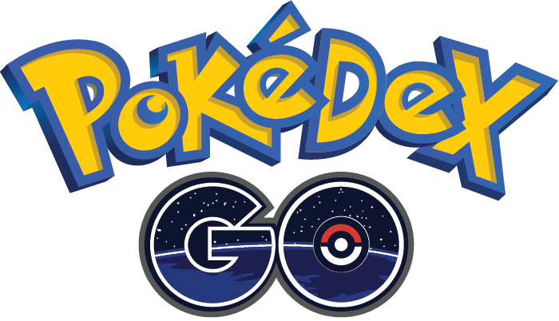
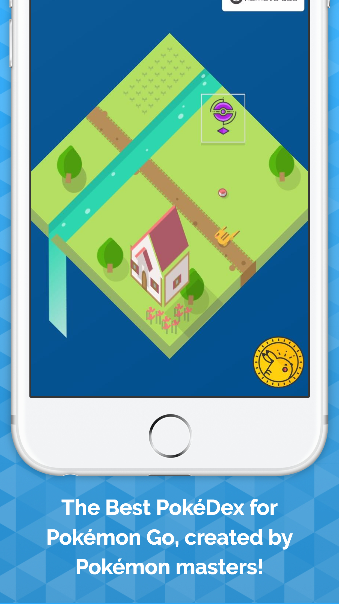
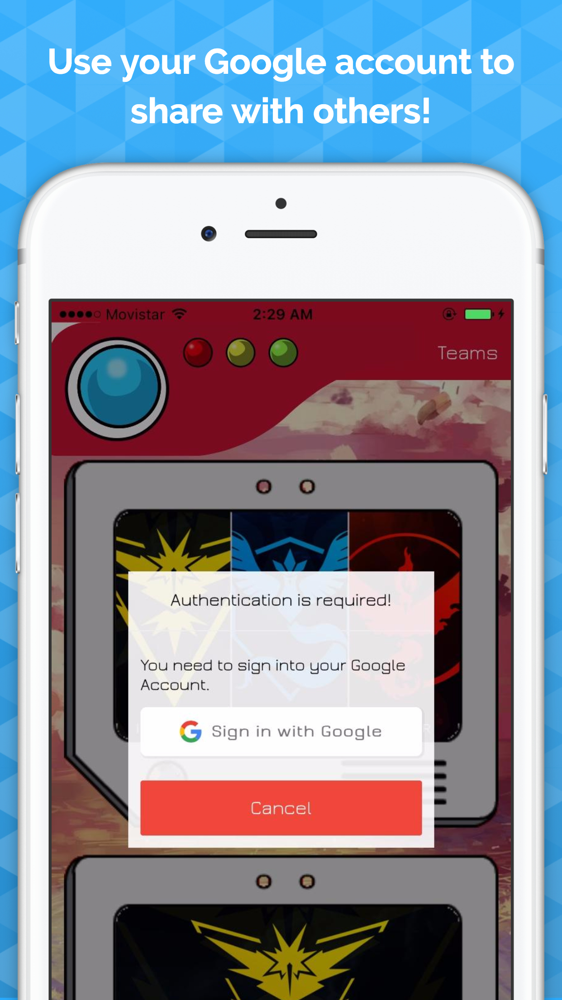
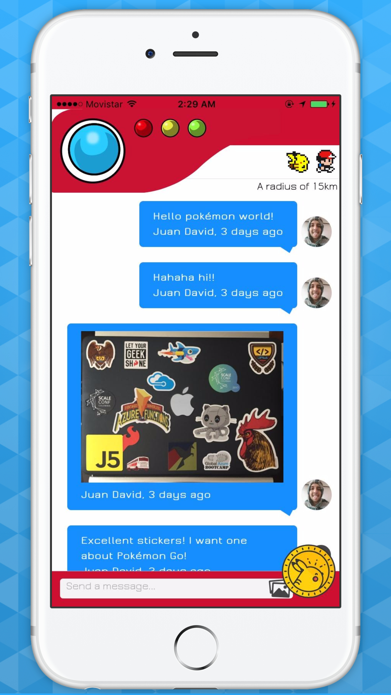
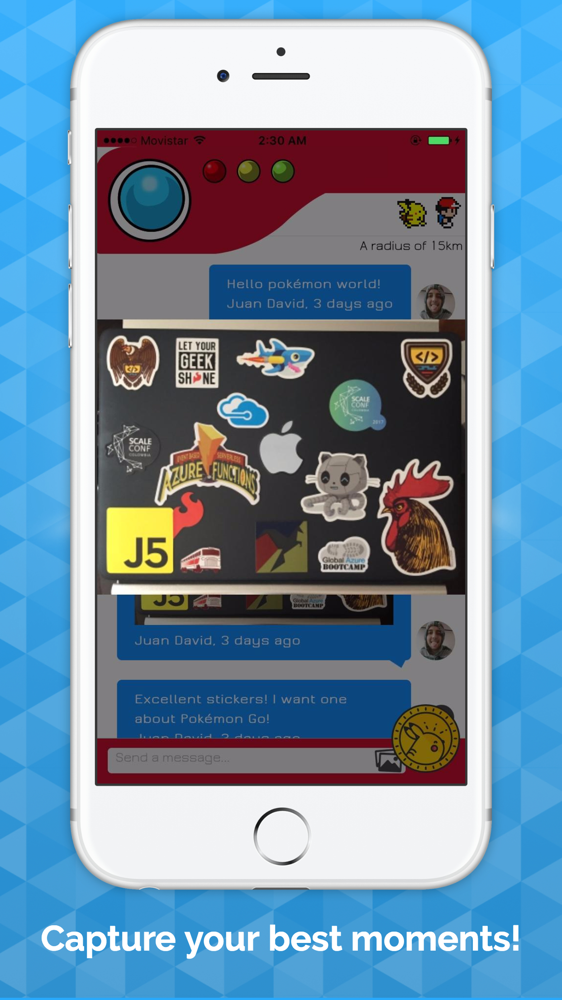

# PokéDex GO - Community

  

## Screens

|
|
|

:---: |:---: |:---: |:---: |
>Images are created using [LaunchKit](https://github.com/launchkit/launchkit)

## Introduction
Hello! I'm the Professor Oak, I am creating this app so you can start your Pokémon adventures, and nothing better to be part of a community of Pokémon trainers.

I want you to help me grow the community and have incredible adventures together!
Now is your chance to talk to other nearby trainers from each team, create events to lead the greatest battles, share your experiences with other players and make friends wherever you go.

Feel free to send your comments and/or suggestions to: jdnichollsc@hotmail.com

PokéDex Go is a community app and therefore relies on the contributions made by users.

## Demo
Do you want to see this app in action?
* Preview the app using **[Ionic View App](http://view.ionic.io/)** with the ID: 8d5cd27d

## WARNING
PokéDex Go is not an associate or promoted by Pokémon, Nintendo or Niantic. This app is being built by Pokémon masters to help the Pokémon community.

## CREDITS
The application has been built with Web technologies HTML, CSS and Javascript using different frameworks like Angular.js, Ionic Framework, Firebase, GeoFire, etc and compiled as a hybrid application using PhoneGap / Cordova. To learn more about reviewing the documentation: https://github.com/jdnichollsc/Ionic-Starter-Template

- Icons created by Roundicons Freebies (CC BY 3.0): http://www.flaticon.com/packs/pokemon-go
- CSS Isometric Pokemon: https://codepen.io/littleginger/pen/avWEGN
- Loading: http://codepen.io/michito/pen/NAYPvP
- Developer: Juan David Nicholls Cardona - Medellín / Colombia.

## Features

- **[In-App Purchase](https://github.com/j3k0/cordova-plugin-purchase)** to **Remove Ads**.
- Mobile App Monetization & **In App Advertising** with **[Google AdMob](https://github.com/floatinghotpot/cordova-admob-pro)**.
- **[Native Audio](https://github.com/floatinghotpot/cordova-plugin-nativeaudio)** **(Click to Pikachu!)**.
- **Geolocation** to get the current position.
- **Google Native Authentication** with **Firebase** (Browser is supported too).
- **Chat** with channels and **Realtime location queries** with Firebase using **GeoFire**.
- ActionSheet to upload images (Converting the base64 to Blob) using **Firebase Storage**.
- Checking the Network to **reconnect** (Supporting timeout).
- Deploy mobile app updates using **[Ionic Deploy](https://docs.ionic.io/services/deploy/)** **(Live deployments with CodePush)**.
- **Multi-Language** Support.
- Beautiful animations with **CSS3**!

## Other Projects
- **[Ionic Starter Template](http://market.ionic.io/starters/ionic-starter-template)**
- **[IonPhaser](http://market.ionic.io/plugins/ionphaser)**
- **[Ionic Drag and Drop](https://github.com/jdnichollsc/Ionic-Drag-and-Drop)**
- **[Game of Drones](https://github.com/jdnichollsc/Game-of-Drones)**

## Supporting
I believe in Unicorns 🦄
Support [me](http://www.paypal.me/jdnichollsc/2), if you do too.

## Happy coding
Made with <3

